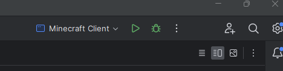

# kgl-dev

## Prerequisites
- install IntelliJ IDEA Community Edition (the free version): https://www.jetbrains.com/idea/download/?section=windows
- clone this project
- have Java 17
- take a brief look at this: https://fabricmc.net/wiki/tutorial:setup

## How to get the Minecraft environment running:
1. Open the Project in IntelliJ IDEA
2. Let IntelliJ and Gradle do their thing (this might take a while)
3. Close IntelliJ
4. Open IntelliJ again
5. You should now see this:
   
6. Click on the Bug symbol or press Shift+F9
7. IntelliJ should now start the Minecraft environment
8. In Minecraft, click on "Singleplayer" and then on "Create New World"
9. Set the Game Mode to "Creative" and click on "Create New World"
10. In the Minecraft world, press R to open the KGL GUI